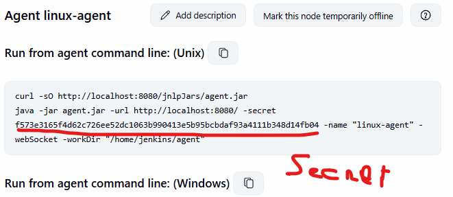
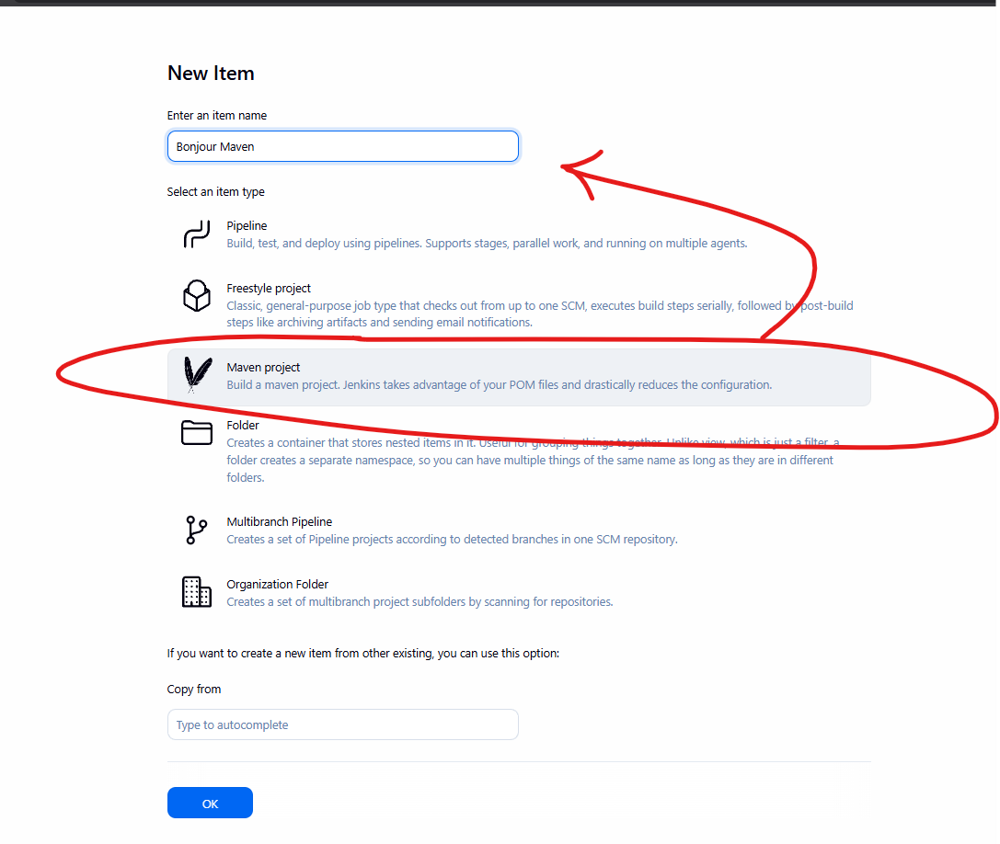
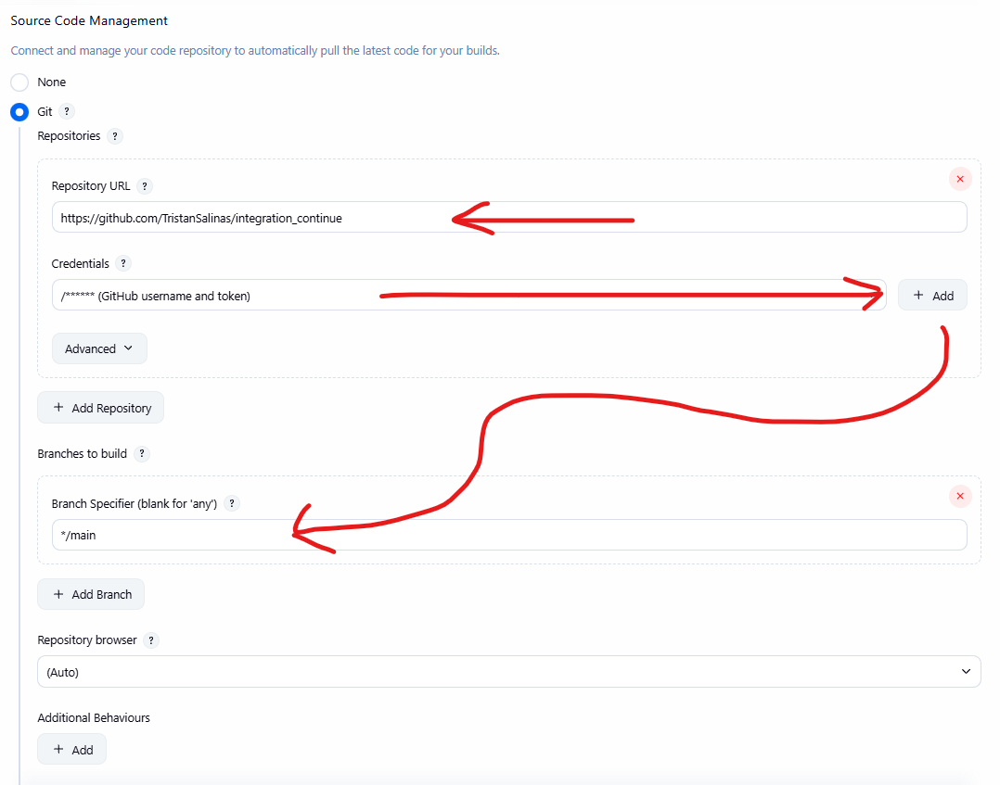
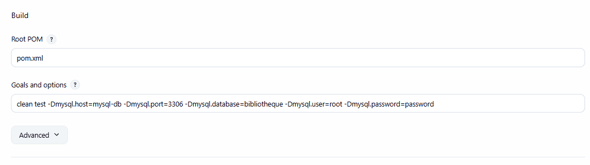
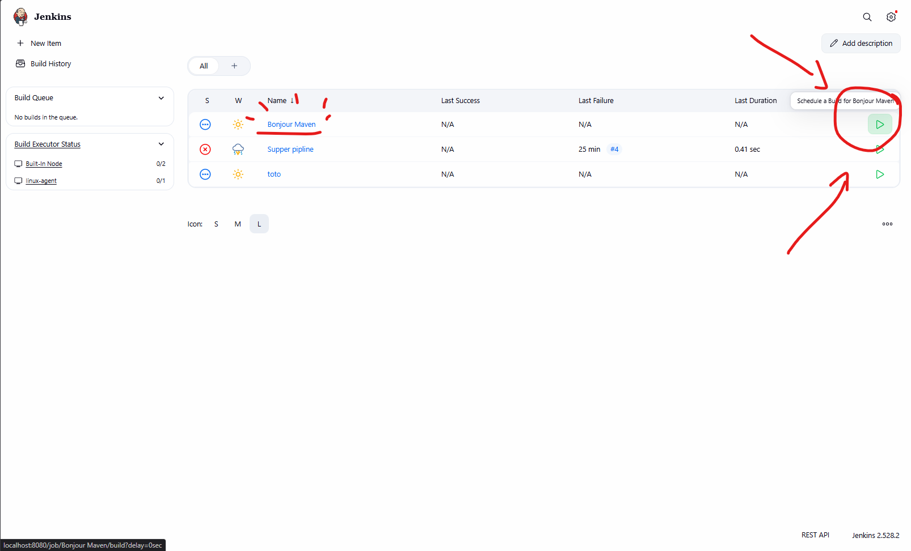

# Set up du projet

> **C'est beau mais c'est long.**

Mais ca aurais été plus long sans le plugin configuration-as-code qui nous permet de faire un setup un peu automatique de jenkins avec [un fichier yml](./cicd/jenkins/casc.yml)

> **Mais c'est long quand même.**

## Etape 1: Cloner le repo

Cloner le repo

```
git clone git@github.com:TristanSalinas/integration_continue.git
```

## Etape 2: .env

Ne pas le faire rajoute du travail à l'etape 5.\
Pour que le jenkins en local puisse dans un job demander à un agent de pull le projet il lui faut un compte et un Token github. Il faut mettre ces infos dans le .env à coté ou à la place du .env.example

> ```
> JENKINS_GITHUB_TOKEN = SUPER_UPPER_DUPER_SECRET_TOKEN
> GITHUB_USERNAME=CAPTAIN_USER
> ```
>
> [./cicd/.env.example](./cicd/.env.example)

Sur l'interface github pour generer un token le chemin est le suivant :

> Profil -> Settings -> Developer settings -> Personal access tokens -> generate new token

Conseil: faites un token avec le moins de droits possibles.

## Etape 3: Docker compose

Le docker compose lance trois choses :

- Jenkins
- Un container qui portera la bdd
- Un container qui sera notre agent linux.

Pour ce faire on lance les containers avec le docker-compose.yml dans le cicd.

```
...\integration_continue\cicd> docker compose up -d
```

⚠️ L'image de l'agent est lourde c'est un ubuntu. Avec les autres deps et l'image de jenkins le premier compose peut prendre un peu de temps \
\
C LON

Docker ps devrai donner :

```
integration_continue> docker ps
CONTAINER ID   IMAGE                      COMMAND                  CREATED          STATUS         PORTS                                              NAMES
5cca20d03cbd   cicd-jenkins-agent-linux   "sleep infinity"         10 seconds ago   Up 8 seconds                                                      jenkins-agent-linux
09f945bece91   cicd-jenkins               "/usr/bin/tini -- /u…"   11 seconds ago   Up 8 seconds   0.0.0.0:8080->8080/tcp, 0.0.0.0:50000->50000/tcp   jenkins-controller
d2209a685498   cicd-mysql                 "docker-entrypoint.s…"   11 seconds ago   Up 9 seconds   0.0.0.0:3306->3306/tcp, 33060/tcp                  mysql-db
```

## Etape 4: Connecter l'agent

Pour connecter l'agent et le rendre pilotable par jenkins une fois celui ci bien lancé, allez sur [http://localhost:8080/computer/linux-agent/](http://localhost:8080/computer/linux-agent/)

Récuperez le secret \



Et lancez cette commande **avec le secret** :

```
docker exec -it jenkins-agent-linux /usr/local/bin/jenkins_connect.sh 123votre-secret-ici123
```

## Etape 5: Setup le Job

allez sur [http://localhost:8080/view/all/newJob](http://localhost:8080/view/all/newJob)



Choisissez Maven project et cliquez ok

---

### 5.1 GENERAL


- Cochez "Restrict where this project can be run"
- avec > linux-agent en label expression

---

### 5.2 LE REPO GIT section Source Code Management

COchez la case GIT


- le repo est toujours: https://github.com/TristanSalinas/integration_continue
- La branche c'est \*/main
- Les credentials sont dans le dropDown si l'etape 2 a été bien faite et a fonctionnée.

---

### 5.3 SECTION BUILD Goals and options :

Dans "goal and options" mettre :

```
clean test -Dmysql.host=mysql-db -Dmysql.port=3306 -Dmysql.database=bibliotheque -Dmysql.user=root -Dmysql.password=password
```


On passe les credentials de db avec la commande de test c'est moche mais parfois c'est la vie.

## Etape 6: LANCER LE JOBE

retour sur http://localhost:8080/


Le job devrai pull le projet dans le container le compiler et lancer les tests.
